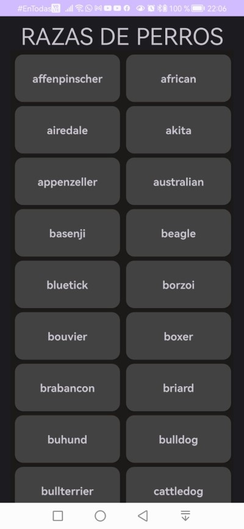
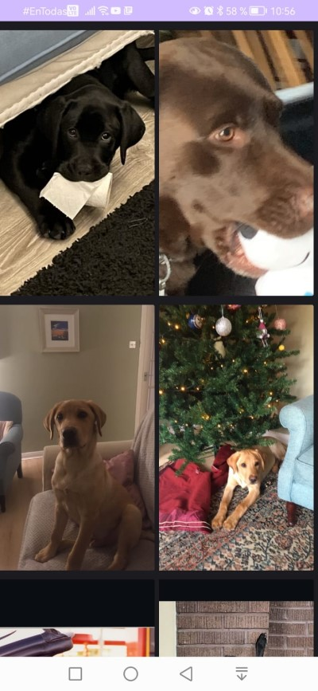

# Aplicaicon de Perritos

##  Contacto
[](mailto:oskar310cl@gmail.com)

##  Technologias & Herramientas


## Dependencia
- [Material Design](https://material.io/develop/android/docs/getting-started) - Utilidades de diseño
- [Retrofit](https://square.github.io/retrofit/) - Consumo de API
- [Coil](https://coil-kt.github.io/coil/) - Importar imágenes
- [Lifecycle](https://developer.android.com/jetpack/androidx/releases/lifecycle) - Respuesta segun ciclo de vida de los componentes
- [Room](https://developer.android.com/jetpack/androidx/releases/room) - Acceso a base de datos

## Descripción
Este proyecto es una aplicación Android desarrollada en Kotlin. La aplicación consiste en el despliegue de una lista de razas de perros llamada desde una API y cargado a una base de datos local. Al momento de hacer clic en una raza muestra otro listado pero con imagenes reales perritos de la raza seleccionada.

## Consumo de API
## Pagina
```bash
  https:/dog.ceo/
```
## Listado de razas
```bash
  https:/dog.ceo/api/breeds/list/all
```
## Una raza
```bash
  https:/dog.ceo/api/breed/{id}/images
```

## Capturas de pantalla
<picture>
  <source media="(prefers-color-scheme: dark)" srcset="screenshots/Principal1.jpg">
  
</picture>
<picture>
  <source media="(prefers-color-scheme: dark)" srcset="screenshots/Detalle1.jpeg">
  
</picture>

## Funcionamiento
- La aplicación inicia en la pantalla de RecyclerView con el listado de razas cargadas desde el API.
- Al realizar click en una en particular, esta muestra otro RecyclerView de un listado de imagenes de esa raza.
 
